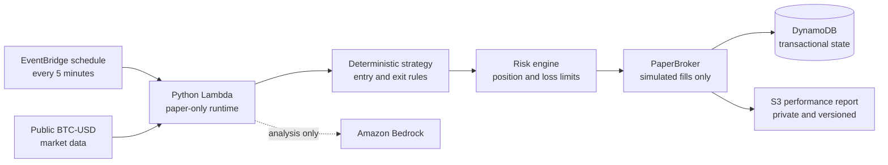

# Bitcoin Paper Trading Agent

> **PAPER TRADING ONLY** — educational and research software. This project cannot place real cryptocurrency orders and does not contain private exchange credentials.

This repository is a public-safe engineering showcase of a BTC-USD paper-trading agent. It demonstrates deterministic strategy execution, simulated order handling, portfolio risk controls, transactional persistence, performance reporting, automated tests, and AWS infrastructure as code.

The repository is a sanitized snapshot. It does not expose the private deployment, its AWS account, resource names, runtime data, or paper-trade history.

## Public read-only dashboard

The included Streamlit dashboard is a separate observability surface. It displays sanitized paper portfolio values, BTC-USD candles, simulated entries and exits, strategy and risk status, performance metrics, and recent paper trades. It has no order controls, AWS SDK client, credential input, private gateway, or write-capable data path.

Run it locally with the bundled sanitized sample report:

```bash
python -m pip install -r requirements.txt -r requirements-dashboard.txt
python -m streamlit run streamlit_app.py
```

For a live public deployment, the site operator—not a visitor—can configure two environment variables:

- `PUBLIC_REPORT_URL`: the fixed HTTPS address of one sanitized JSON document
- `PUBLIC_REPORT_ALLOWED_HOST`: the exact hostname permitted by the dashboard

Both values must be present, the URL must use HTTPS, redirects and query strings are rejected, and no credentials are accepted. If the source is missing, malformed, or unavailable, the dashboard displays `Data temporarily unavailable` and never falls back to private AWS access.

The strict public contract is defined in `src/public_dashboard/models.py`; `data/public_report.example.json` is synthetic and contains no private project data. A validated live document displays the badge `LIVE PROJECT DATA — PAPER TRADING ONLY`, while the bundled file is explicitly labeled as sample data.

The safest future publication flow is:

```text
private paper agent
  -> allowlisted sanitizer/exporter
  -> separate public-read origin containing only public_report.json
  -> CDN with HTTPS, caching, and no write route
  -> read-only Streamlit dashboard
```

The exporter should assume a narrow role that can read only the required private reporting records and write only the sanitized object. The dashboard should receive anonymous `GET` access to that one public document and no AWS identity or permissions.

## What it does

- Reads public BTC-USD market data.
- Evaluates a deterministic dip-entry strategy every five minutes.
- Simulates paper BUY entries and TAKE PROFIT, STOP LOSS, and TRAILING STOP exits.
- Rejects leverage, margin, shorting, unsupported assets, stale data, and unsafe inputs.
- Uses idempotency keys and transactional persistence to prevent duplicate paper orders.
- Maintains portfolio and position state across stateless runtime invocations.
- Produces a latest paper-performance report after committed simulated trades.
- Supports analysis-only model output that is constrained to HOLD or NO_TRADE.

## Architecture



The runtime has no public API endpoint and no live broker implementation. `PaperBroker` calculates simulated fills and portfolio changes entirely inside the application.

## Automated trading cycle

1. EventBridge invokes the runtime on a five-minute schedule.
2. The runtime validates that it is locked to `PAPER_MODE=true` and `BTC-USD`.
3. Fresh public candles are loaded through an allowlisted market-data adapter.
4. Open positions are checked for take-profit, stop-loss, and trailing-stop exits before new entries are considered.
5. The entry strategy measures the current dip against its configured lookback.
6. The risk engine accepts, resizes, or rejects a proposal.
7. A simulated fill, risk decision, portfolio snapshot, and idempotency record are committed atomically.
8. Best-effort reporting writes `reports/paper_performance/latest.json`. Reporting failure cannot reverse a committed paper trade.

## Risk controls

- BTC-USD allowlist enforced by typed models and runtime checks.
- Paper execution mode enforced at configuration and request boundaries.
- No leverage, margin, or short positions.
- Maximum position sizing and daily-loss/drawdown limits.
- Fresh-market-data requirement.
- Strategy allowlist and strict request schemas.
- Server-side risk sizing rather than trusting proposed quantities.
- Idempotent submission and conflict detection.
- DynamoDB transactional commits for orders, fills, risk decisions, and state.
- Fail-closed behavior when authoritative risk state is unavailable.

## Paper-trading safeguards

There is no private Coinbase client, exchange signing code, API-secret loader, or live-order method. Coinbase is used only as a source of public BTC-USD market data. AWS permissions are scoped to the paper-trading data flow and do not grant exchange access.

## Performance reporting

After a simulated trade commits, the reporter builds a small JSON snapshot containing paper portfolio values, simulated P&L, drawdown, and the latest paper fill. The CDK example creates a private, versioned, S3-managed-encrypted bucket and grants only `s3:PutObject` under `reports/paper_performance/*`.

Reporting is best-effort and disabled unless its destination is configured. A reporting outage cannot reject or roll back an already committed paper trade.

## AWS services represented

- AWS Lambda for the private Python runtime
- Amazon EventBridge for five-minute evaluations
- Amazon DynamoDB for transactional paper state
- Amazon S3 for versioned paper-performance reports
- Amazon Bedrock for constrained analysis-only decisions
- Amazon CloudWatch Logs for runtime observability
- AWS CDK and CloudFormation for infrastructure definitions

Resource names are intentionally generated or supplied as deployment-time parameters. No identifiers from the private environment are included.

## Project layout

```text
src/agent/         Request validation, orchestration, and Lambda handler
src/strategies/    Entry and automated exit logic
src/risk/          Position sizing and portfolio guardrails
src/broker/        Simulated PaperBroker implementation
src/portfolio/     Paper portfolio accounting
src/agent/store.py Persistence contract and in-memory test implementation
src/agent/dynamo_store.py DynamoDB transactional adapter
src/reporter/      Best-effort paper-performance reporting
src/market_data/   Public market-data adapter
src/backtesting/   Local backtesting support
cdk/               Sanitized infrastructure-as-code examples
tests/unit/        Unit, adversarial, failure-mode, and CDK tests
```

## Run locally

Python 3.12 is recommended.

```bash
python -m venv .venv
python -m pip install -r requirements.txt -r requirements-dev.txt -r requirements-dashboard.txt -r cdk/requirements.txt
python -m pytest -q
python -m compileall src streamlit_app.py
python cdk/run_synth.py
```

CDK synthesis is local validation only. The runtime stack expects deployment-time values such as `<paper-orders-table>` and `<paper-agent-function>`; none of the private environment's values are included here.

## Testing

The suite covers:

- strategy entries and automated exits
- portfolio and risk invariants
- rejection of unsafe or malformed agent output
- stale market data and asset allowlisting
- idempotency and DynamoDB transaction behavior
- transient and permanent AWS failure handling
- reporting success and failure isolation
- least-privilege and paper-only CDK assertions

GitHub Actions runs tests, byte-compilation, and CDK synthesis on pushes and pull requests to `main`. It does not deploy infrastructure.

## Current status

The project is an active paper-trading experiment. Its architecture and safety controls are implemented, and the strategy is being evaluated with simulated funds. The public repository contains no private runtime state or performance claims.

## Current Experiment

The deterministic strategy is being forward-tested with simulated money while paper-performance data is collected. That evidence is intended to measure behavior, risk, and operational reliability before any separate future discussion of live-money experimentation. No profitability claim is made.

## Safety

This software contains no live-money execution path and must not be interpreted as financial advice, a trading recommendation, or a guarantee of returns. Cryptocurrency markets are volatile, and simulated results do not predict real-world performance. Keep all experiments in paper mode and independently review security, risk controls, and infrastructure before adapting any part of the project.

## License

Released under the MIT License. See [LICENSE](LICENSE).
